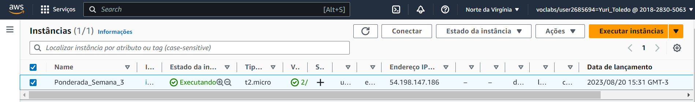
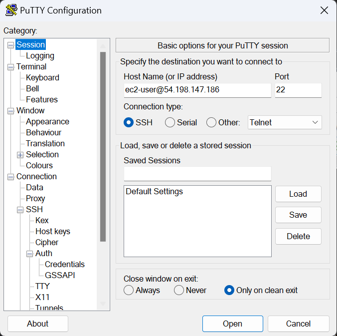
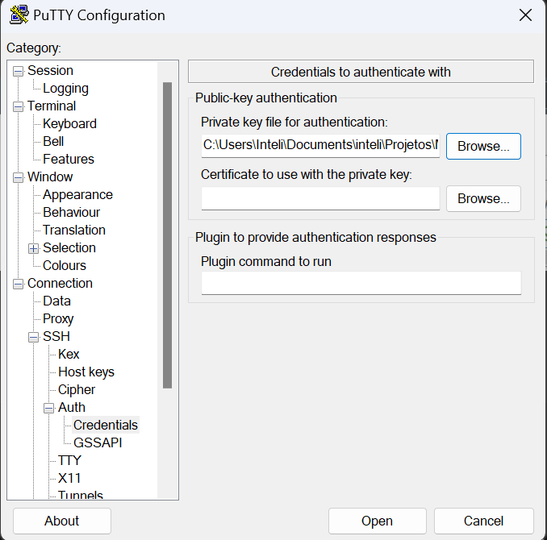
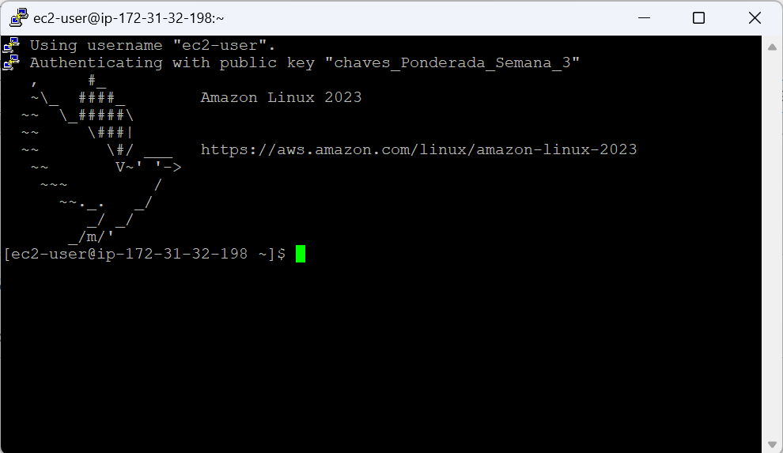

# Ponderada_semana_3

## Introdução
Neste relatório, documentamos o processo de criação e acesso a uma instância EC2 na AWS usando SSH.

## Objetivo 
O objetivo é demonstrar como criar uma instância EC2 e acessá-la via SSH.

## Materiais
- Conta AWS.
- Ferramenta PuTTY.
- Arquivo .pem fornecido pela AWS durante a criação da instância.

## Método
Para isso, seguiu-se as seguintes etapas:
1. Logou-se na AWS Academy e iniciou o lab.
2. Clicou-se em AWS para ser redirecionado para a página de serviços da AWS.
3. Clicou-sem em EC2 e em seguida, em Instâncias.
4. Criou-se uma instância com Amazon Linux, chaves de segurança já em formato ppk com tipo micro t2.

Após isso, com a instância criada, vamos para o Putty para a etapa de acesso com SSH

5. Com o Putty aberto, inseriu-se no campo Host Name: ec2-user@<IPdaEC2>
6. Agora na barra lateral, navegou-se Connection >> SSH >> AUTH >> Credentials
7. No campo private key, informou-se o caminho para a private key baixado no momento da instalação
8. Por fim, clicou-se Open, para acessar a instância

## Resultado
Após conclusão dos passos 1 a 4, obteve-se:

Passo 5:

Passo 7:

Por fim:

## Conclusão

Agora estamos prontos para manipular a nossa instância EC2

